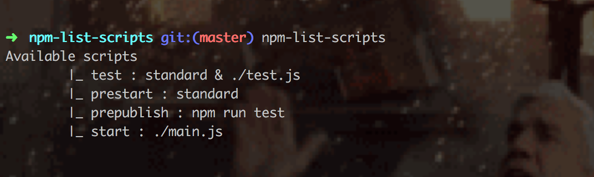

# npm-list-scripts [](https://travis-ci.org/vrunoa/npm-list-scripts)
A simple cli that list current package scripts, because something I forget their names

# Usage
```bash
npm install -g npm-list-scripts
```


